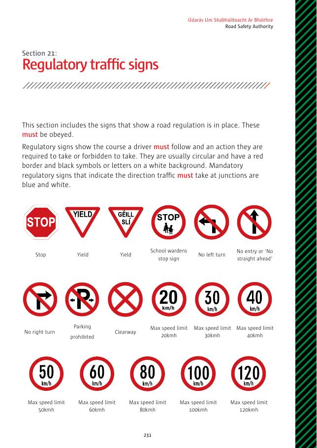
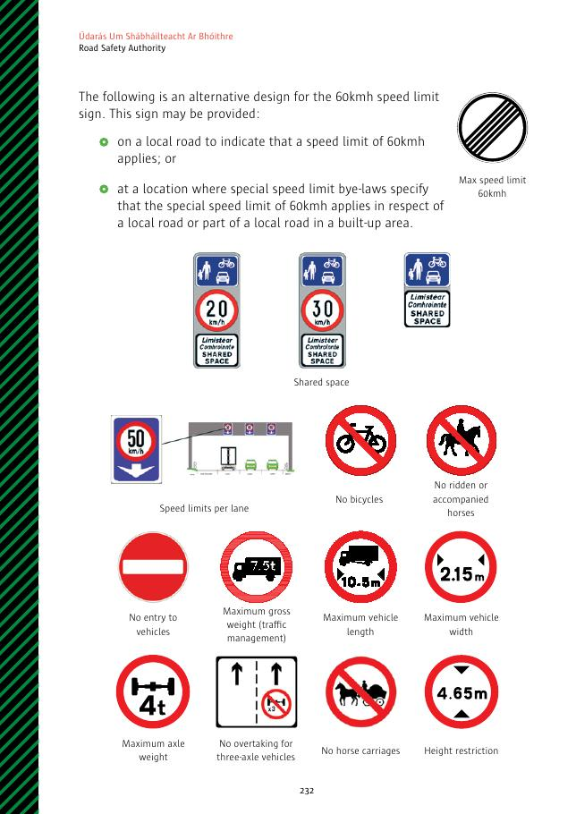
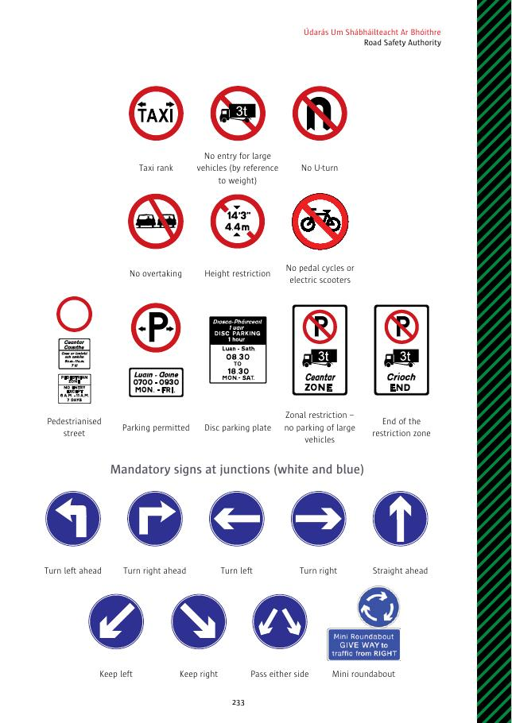
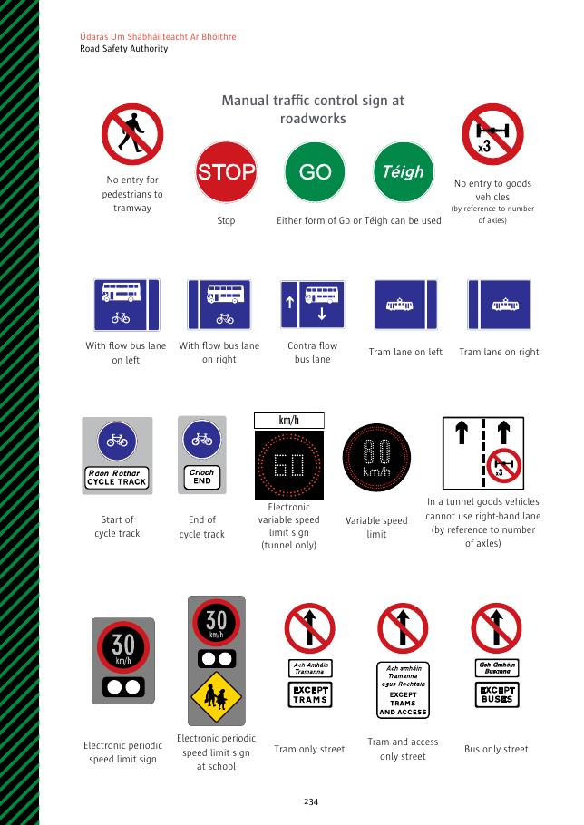
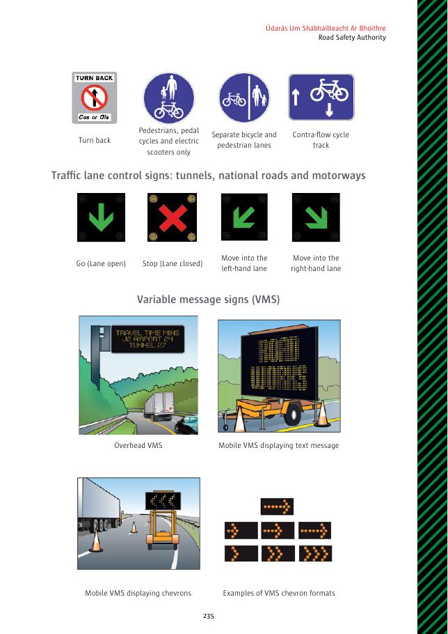

# 第21节：管制交通标志

管制标志表示某项道路规定正在生效，必须遵守。它们说明驾驶人必须采用的路线，以及必须或禁止采取的行动。通常为红边圆形、白底黑色符号或文字；在交叉路口规定必须行驶方向的强制标志则为蓝白色。

## 标志名称

- 停车；让行；学校交通管理员停车；禁止左转；禁止进入或禁止直行；禁止右转；禁止停车；Clearway；20、30、40、50、60、80、100、120 km/h 最高限速。
- 另一款 60 km/h 标志可在地方道路或地方政府附例指定的建成区地方道路使用。
- 按车道限速；共享空间；禁止自行车；禁止骑马或牵马；禁止车辆进入；最大总重量；车辆最大长度、宽度、高度及车轴重量；禁止三轴车辆超车；禁止马车。
- 出租车候客区；按重量禁止大型车辆进入；禁止掉头；禁止超车；禁止脚踏自行车或电动滑板车；步行街；允许停车；停车碟；区域限制大型车辆停车；限制区域结束。
- 强制方向：前方左转、前方右转、左转、右转、直行、靠左、靠右、可从任一侧通过、迷你环形交叉路口。
- 道路施工人工交通控制：停车及 `Go / Téigh` 前进。
- 禁止行人进入电车道；按车轴数量禁止货运车辆进入；左侧或右侧同向公交道；逆向公交道；左侧或右侧电车道。
- 自行车道开始／结束；隧道电子可变限速；可变限速；隧道内按车轴数量禁止货运车辆使用右车道；电子分时限速及学校电子分时限速。
- 电车专用街道；电车及获准车辆专用街道；巴士专用街道；掉头返回；行人、脚踏自行车和电动滑板车专用；自行车与行人分隔车道；逆向自行车道。
- 车道控制：开放、关闭、移入左车道、移入右车道；头顶或移动式可变信息标志及人字形指示。

## 原始标志图页

