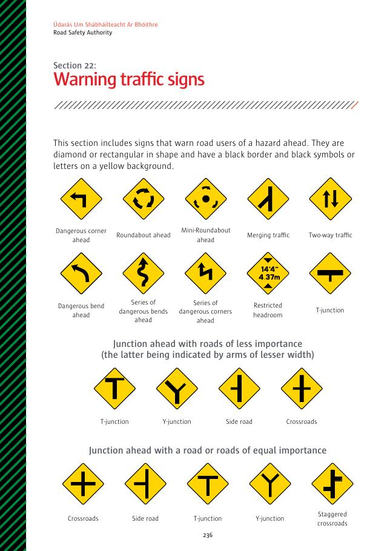
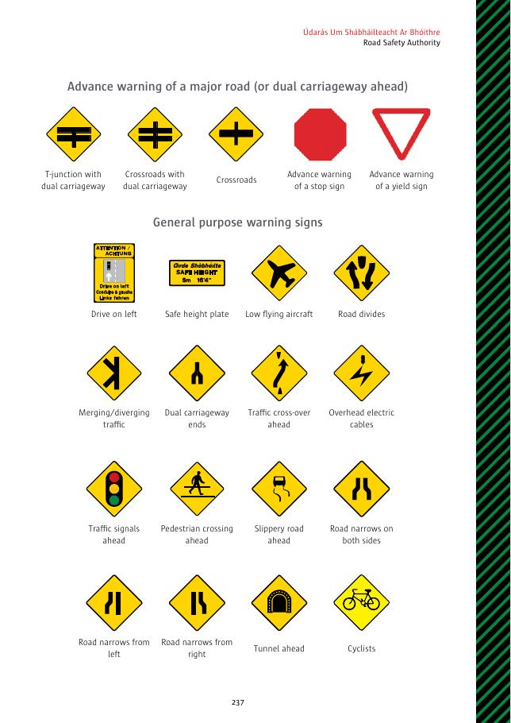
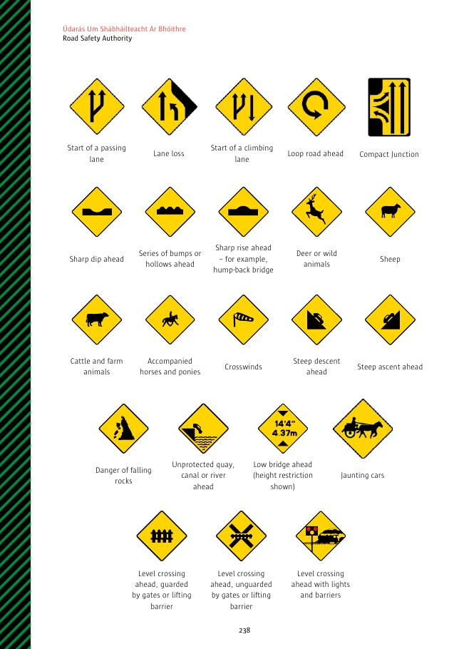
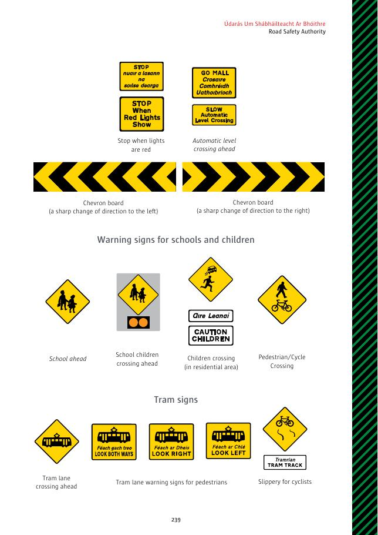

# 第22节：警告交通标志

警告标志提醒前方危险，采用黑边菱形或矩形、黄底黑色符号或文字。

## 标志名称

- 前方危险转角、环形交叉路口、迷你环形交叉路口、车流汇合、双向车流。
- 前方危险弯道、连续危险弯道或转角、限高、T 形路口。
- 与较次要道路交汇：T 形、Y 形、支路、十字路口；与同等重要道路交汇：十字路口、支路、T 形、Y 形、错位十字路口。
- 前方主路或双车道公路：T 形、十字路口；前方停车或让行标志。
- 靠左行驶、安全高度牌、低飞飞机、道路分开、车流汇入／分流、双车道公路结束、前方车流换侧、头顶电线。
- 前方交通灯、行人过街处、路滑、道路两侧或单侧变窄、隧道、骑自行车者。
- 超车道开始、车道减少、爬坡车道开始、前方环形连接道路、紧凑型交叉路口。
- 前方急剧低洼、连续凸起或低洼、急剧上坡或拱桥、鹿或野生动物、绵羊、牛和农场动物、骑乘或牵引马匹、小心侧风、陡下坡、陡上坡。
- 落石危险、无防护码头／运河／河流、前方低桥及限高、观光马车。
- 前方铁路平交道口：有闸门或升降栏杆、无闸门或升降栏杆、带灯光和栏杆；红灯时停车；前方自动平交道口。
- 急剧左转或右转人字板。
- 学校及儿童：前方学校、学童过街、住宅区儿童过街、行人／自行车过街。
- 电车：前方电车道交叉口、面向行人的电车道警告、对骑自行车者路滑。

## 原始标志图页

