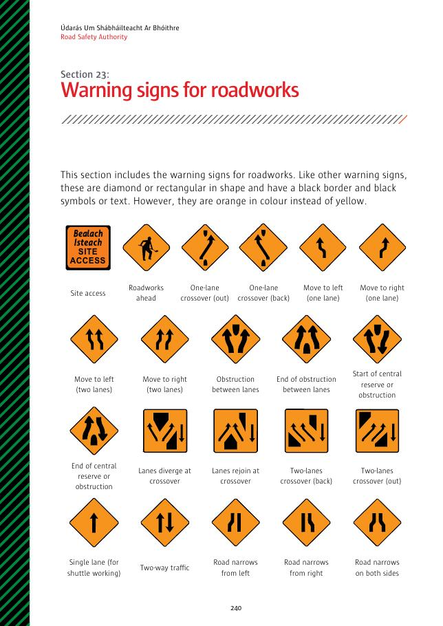
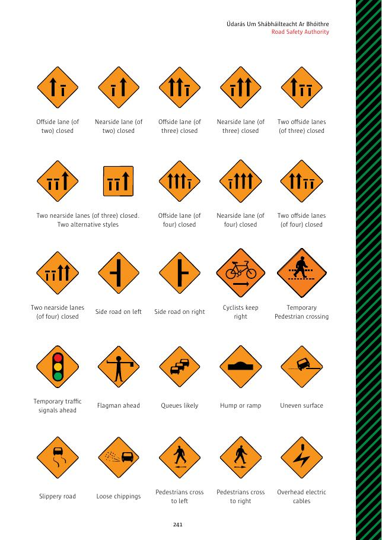
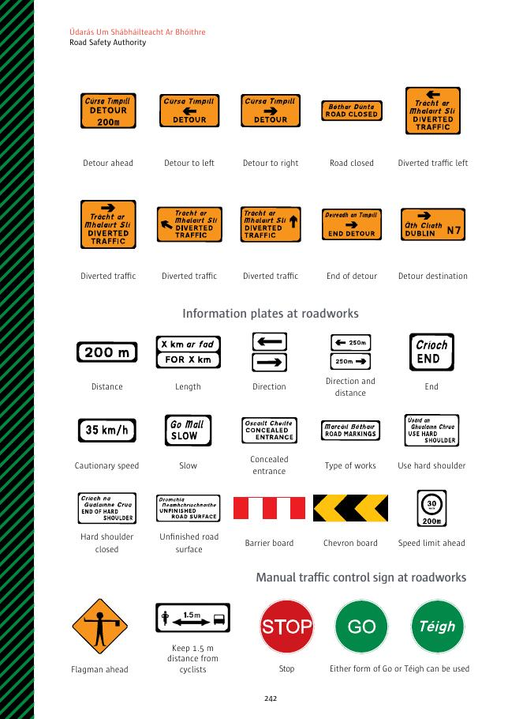

# 第23节：道路施工警告标志

道路施工警告标志与其他警告标志一样，为黑边菱形或矩形、黑色符号或文字，但使用橙色而非黄色背景。

## 标志名称

- 工地出入口；前方施工；单车道换侧驶出／驶回；一条或两条车道向左／右移动；车道间障碍开始／结束；中央分隔带或障碍开始／结束；换侧处分流／汇合；两车道换侧驶入／驶出。
- 单车道穿梭行驶；双向车流；道路左侧、右侧或两侧变窄。
- 两车道或三、四车道公路的外侧／内侧一条或两条车道关闭。
- 左／右支路；骑自行车者靠右；临时行人过街处；前方临时交通灯、旗手、可能排队、凸起或坡道、不平路面、路滑、松散碎石、行人向左／右横过、头顶电线。
- 前方绕道、向左／右绕道、道路关闭、改道车流向左／右／直行、绕道结束、绕道目的地。
- 施工信息牌：距离、长度、方向、方向和距离、结束、建议速度、慢行、隐蔽入口、工程类型、使用硬路肩、硬路肩关闭、未完成路面、护栏板、人字板、前方限速。
- 道路施工人工控制：前方旗手、与骑自行车者保持 1.5 m、停车、`Go / Téigh` 前进。

## 原始标志图页

