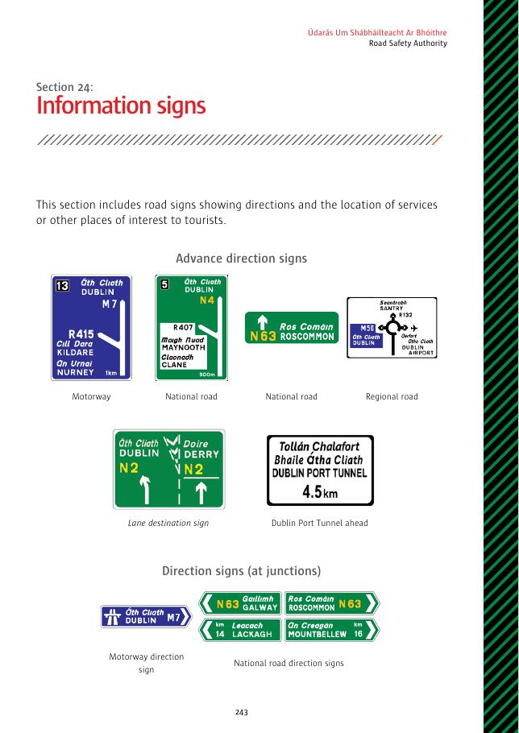
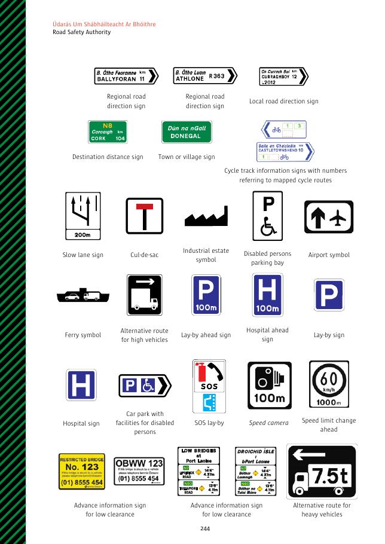
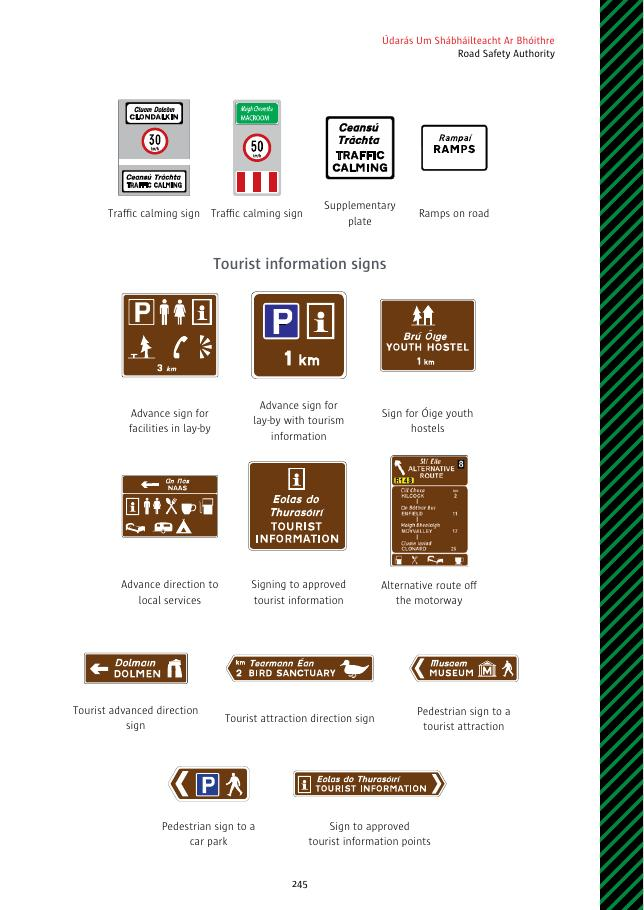

# 第24节：信息标志

信息标志显示方向、服务设施或旅游景点的位置。

## 标志名称

- 预告方向：高速公路、国家级道路、区域道路；车道目的地；前方都柏林港隧道。
- 路口方向：高速公路、国家级道路、区域道路、地方道路。
- 目的地距离；城镇或村庄；带地图路线编号的自行车道信息。
- 慢车道；无出口道路；工业区；残障人士停车位；机场；渡轮；高车辆替代路线；前方停车湾；前方医院；停车湾；医院；带残障设施的停车场；SOS 停车湾；测速摄像机；前方限速变化；前方限高信息及重型车辆替代路线。
- 交通缓和及补充牌；道路减速台。
- 旅游信息：前方停车湾设施、带旅游信息的停车湾、Óige 青年旅舍、当地服务方向、认可旅游信息、离开高速公路的替代路线、旅游预告方向、旅游景点方向、行人前往景点或停车场、认可旅游信息点。

## 原始标志图页

