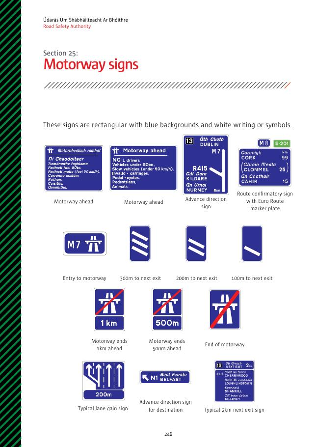
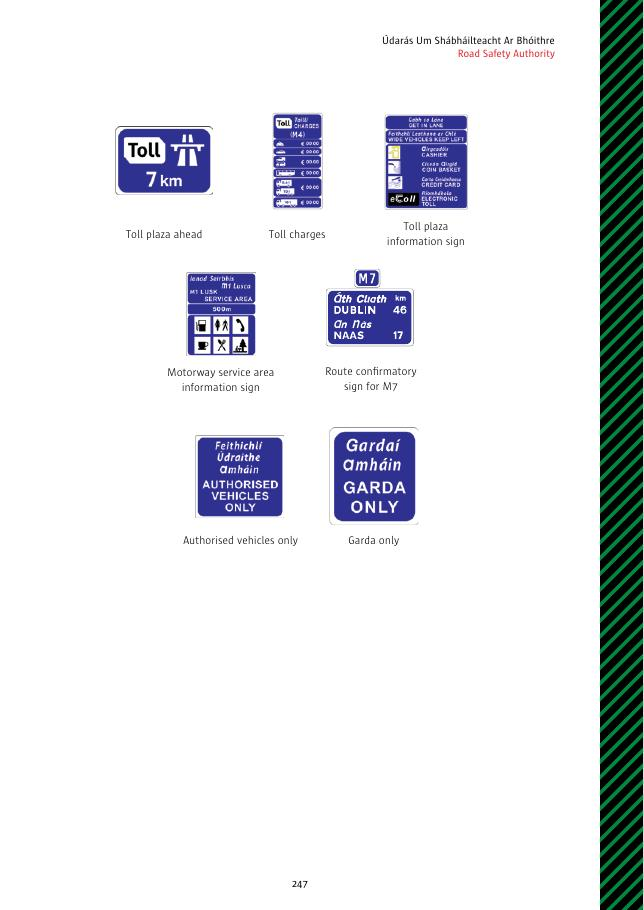

# 第25节：高速公路标志

高速公路标志为蓝底白色文字或符号的矩形。

## 标志名称

- 前方高速公路；预告方向；带欧洲路线编号牌的路线确认标志。
- 进入高速公路；距下一出口 300、200、100 m。
- 高速公路于前方 1 km 或 500 m 结束；高速公路结束。
- 典型增加车道；目的地预告方向；距下一出口 2 km。
- 前方收费站；收费标准；收费站信息。
- 高速公路服务区信息；M7 路线确认；仅限获授权车辆；仅限爱尔兰警察。

## 原始标志图页

