# 附录2：道路交通与安全法律

本附录列出本书内容所依据的主要法律，分为议会法（Acts）以及根据这些议会法制定的条例和命令（Regulations and Orders），供查找相关法律使用。

> 法律文件的正式名称保留英文，不另造中文名称。检索或引用爱尔兰法律时，应使用这些正式标题，并在 [Irish Statute Book](https://www.irishstatutebook.ie) 核实当前合并文本、修订及生效状态。

## 主要《道路交通法》

- `Road Traffic Act 1961`
- `Road Traffic Act 1968`
- `Road Traffic (Amendment) Act 1984`
- `Road Traffic Act 1994`
- `Road Traffic Act 1995`
- `Road Traffic Act 2002`
- `Road Traffic Act 2003`
- `Road Traffic Act 2004`
- `Road Traffic Act 2006`
- `Road Traffic Act 2010`
- `Road Traffic Act 2011`
- `Road Traffic (No. 2) Act 2011`
- `Road Traffic Act 2014`
- `Road Traffic (No. 2) Act 2014`
- `Road Traffic Act 2016`
- `Road Traffic (Amendment) Act 2018`
- `Road Traffic and Roads Act 2023`
- `Road Traffic Act 2024`

## 其他相关议会法

- `Local Authorities (Traffic Wardens) Act 1975`
- `Road Acts 1920, 1993 and 2007`
- `Finance Acts 1960 and 1976`
- `Finance (Excise Duties) (Vehicles) Act 1952`
- `Dublin Transport Authority Act 1986`
- `Dublin Transport Authority (Dissolution) Act 1987`
- `Transport (Railway Infrastructure) Act 2001`
- `Taxi Regulation Acts 2003 and 2013`
- `Railway Safety Act 2005`
- `Safety, Health and Welfare at Work Act 2005`
- `Road Traffic and Transport Act 2006`
- `Road Safety Authority Act 2006`
- `Road Transport Act 2011`
- `Motor Vehicle (Duties and Licences) Acts 2012, 2013 and 2015`
- `Road Safety Authority (Commercial Vehicle Roadworthiness) Act 2012`
- `Non-Use of Motor Vehicles Act 2013`
- `Environment (Miscellaneous Provisions) Act 2015`

## 条例范围

原书完整清单涵盖以下主题及其历年修订：

- 车辆构造、设备、使用、照明、反光器、声音警告装置、轮胎、重量、尺寸和型式核准；
- 驾驶执照、学习许可证、驾驶教练、理论考试、EDT、IBT、外国执照认可及 Driver CPC；
- 机动车保险、保险标志、车辆登记、税务、NCT 和商用车辆适航检测；
- 交通与停车、交通标志、速度限制、公交道、自行车道、手机及罚分／定额罚款；
- 出租车和小型公共服务车辆、道路运输营运者、货运和客运市场、工作时间及行车记录仪；
- 铁路安全、危险品运输、道路基础设施、收费系统、车辆扣押和车轮锁；
- 农业车辆、两轮和三轮车辆、电动车、电动滑板车及动力个人运输器；
- 相关法律条款的生效命令和规定表格。

以下原始页面逐项保留从早期条例至 2025 年条例的每个正式标题。

## 完整官方标题清单

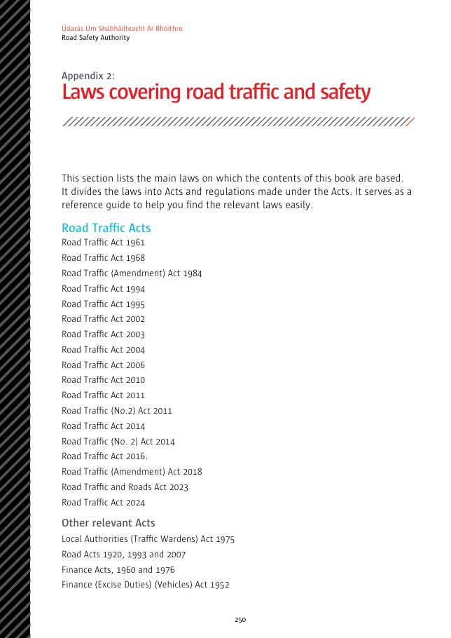

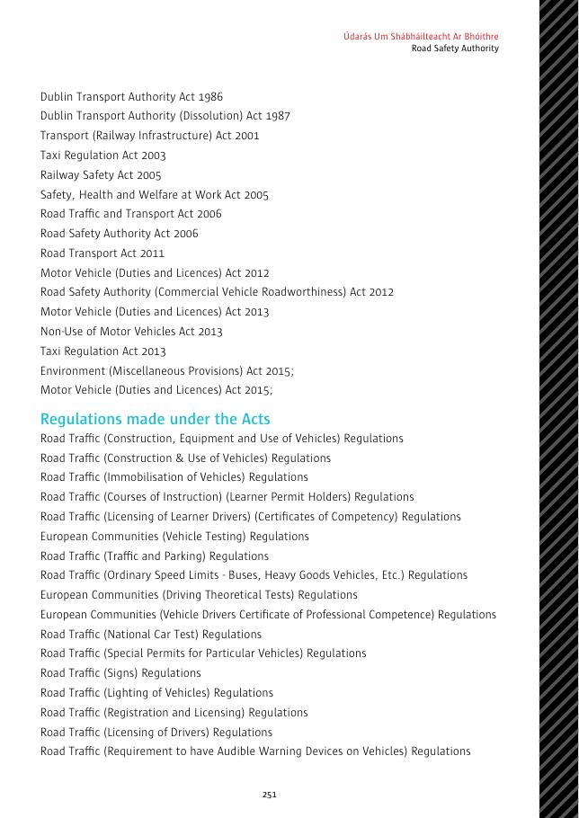

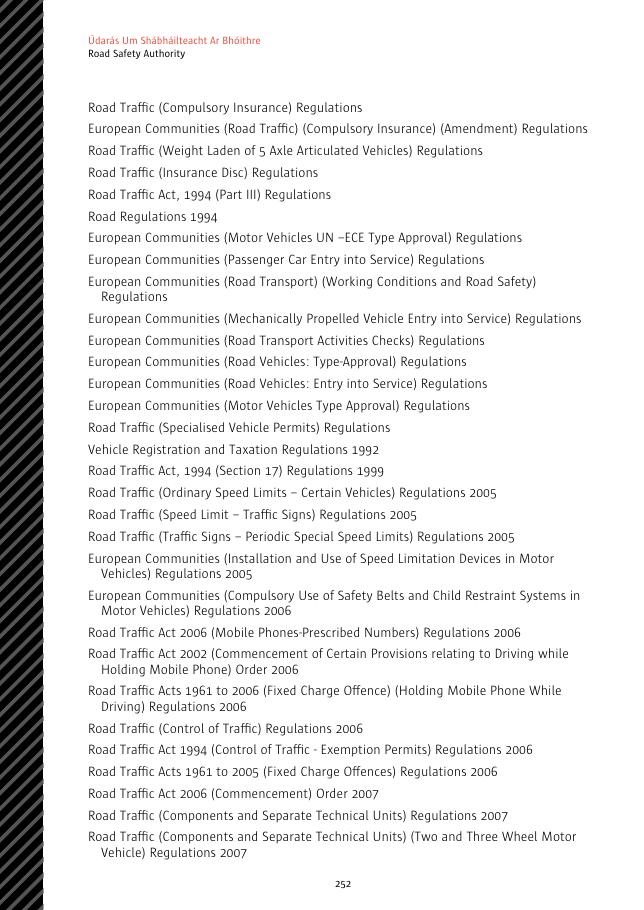

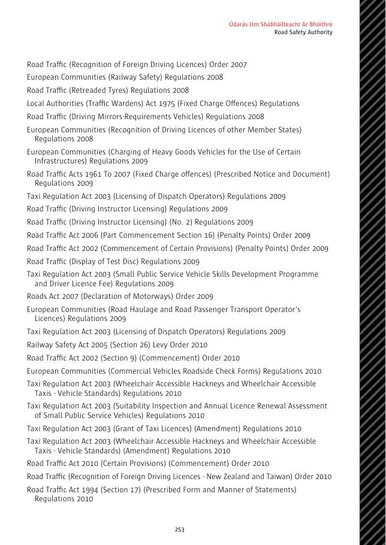

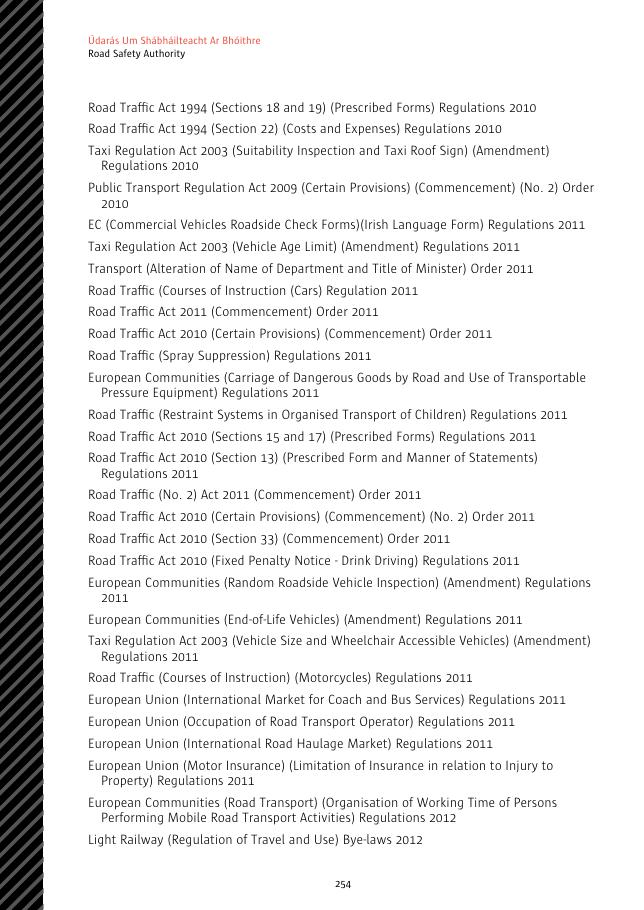

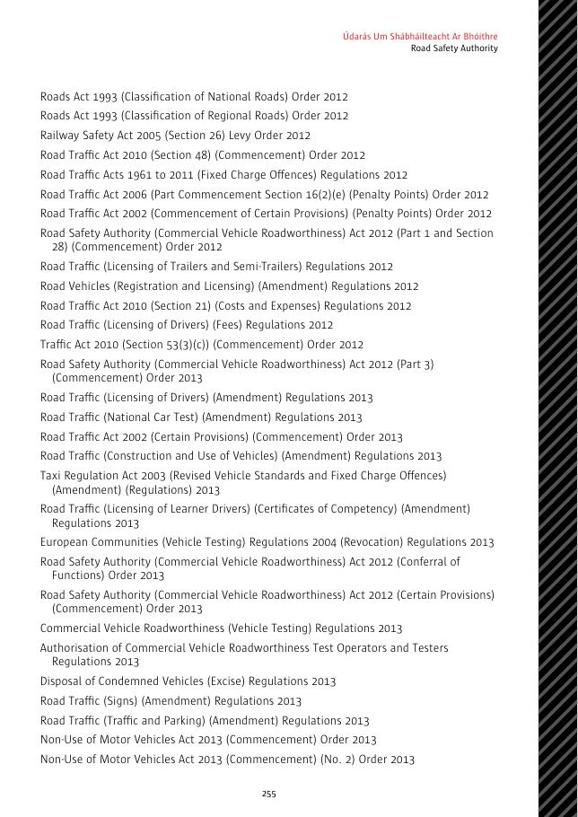

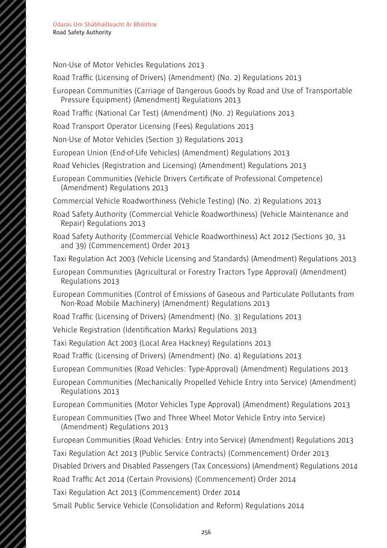

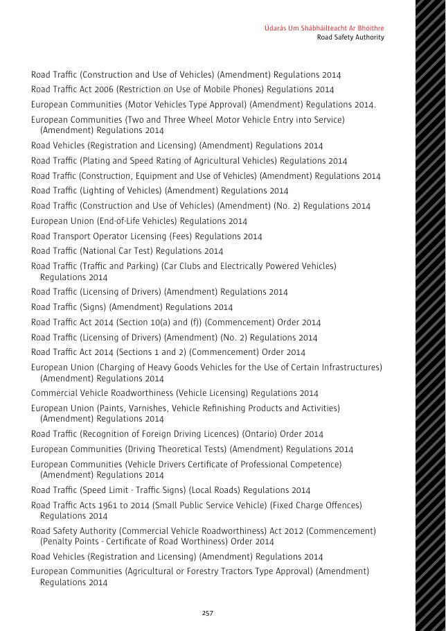

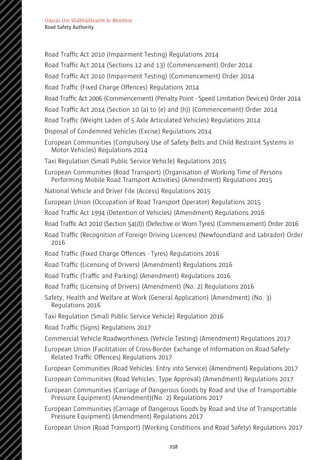

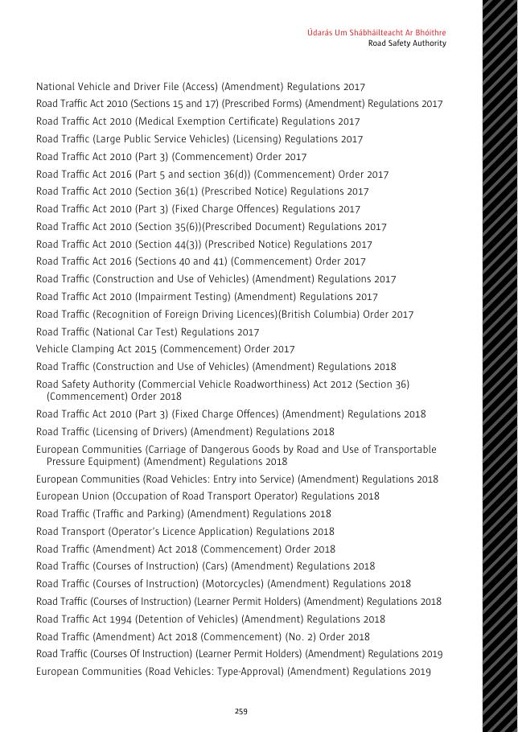

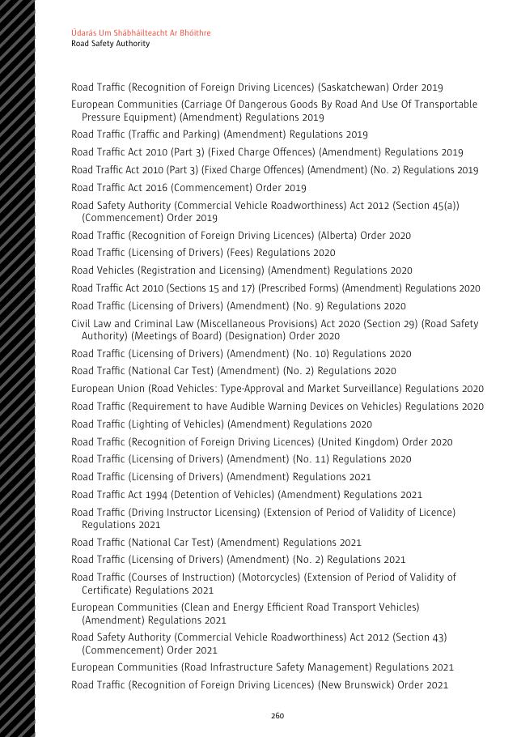

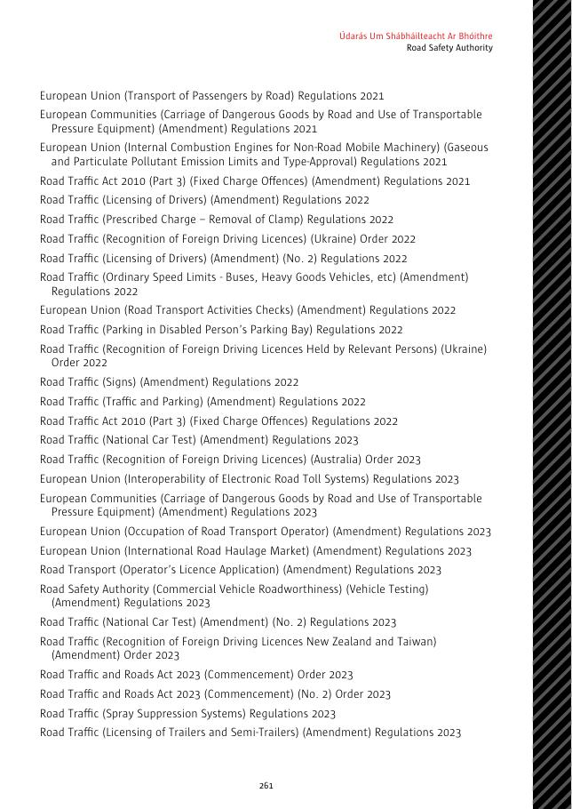

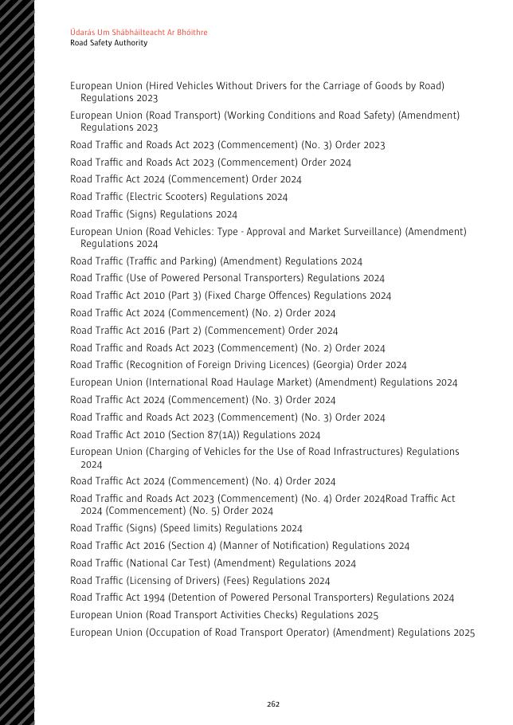
