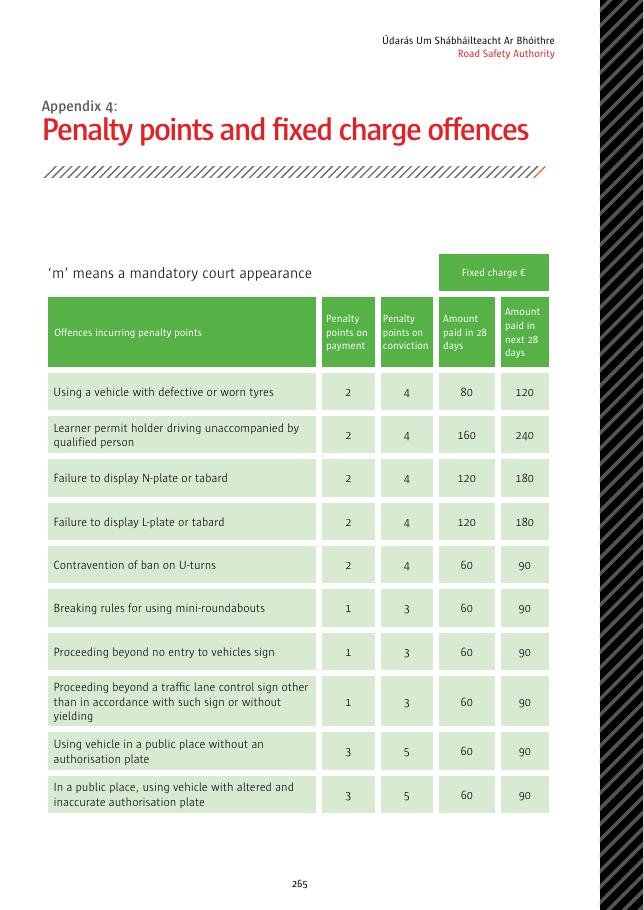
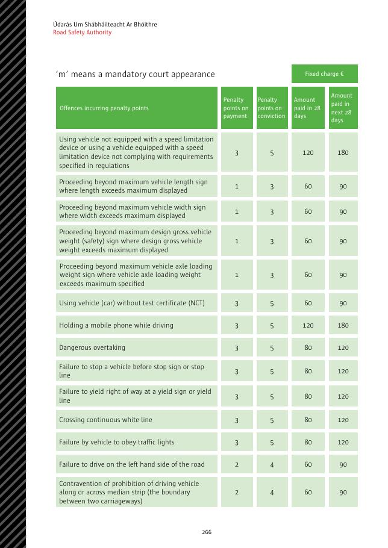
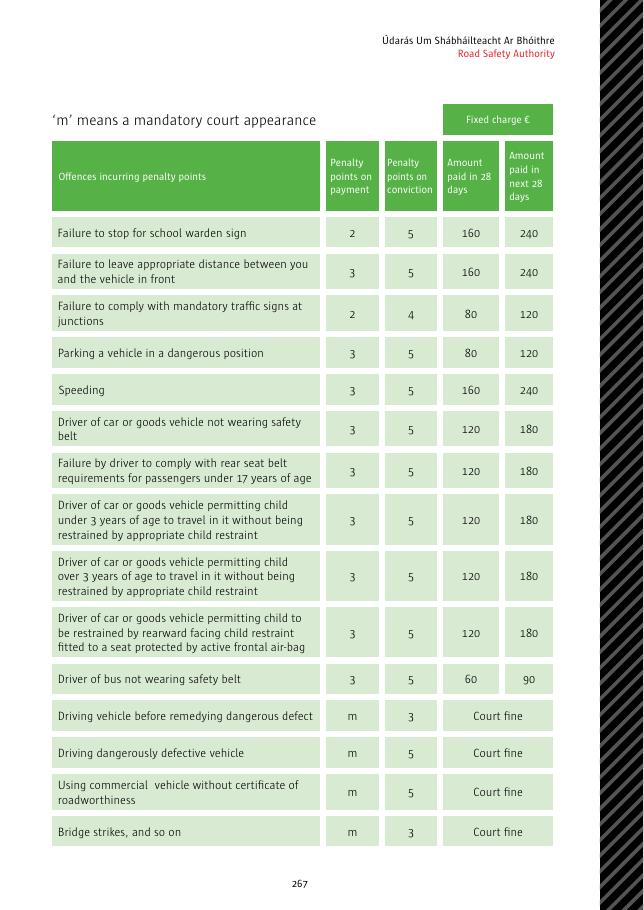
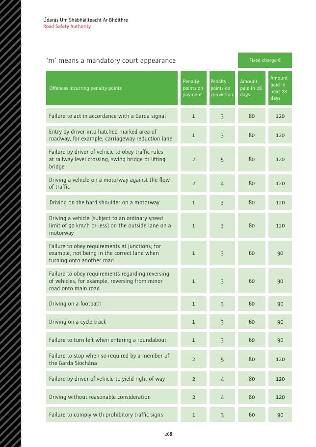
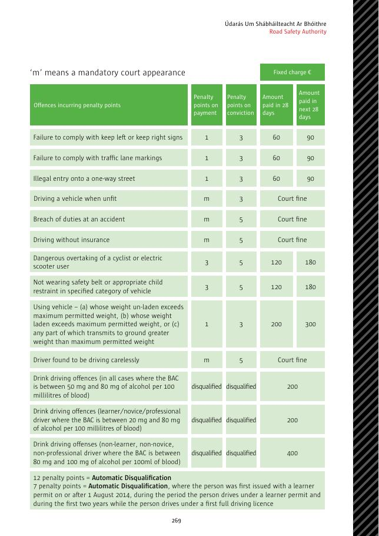
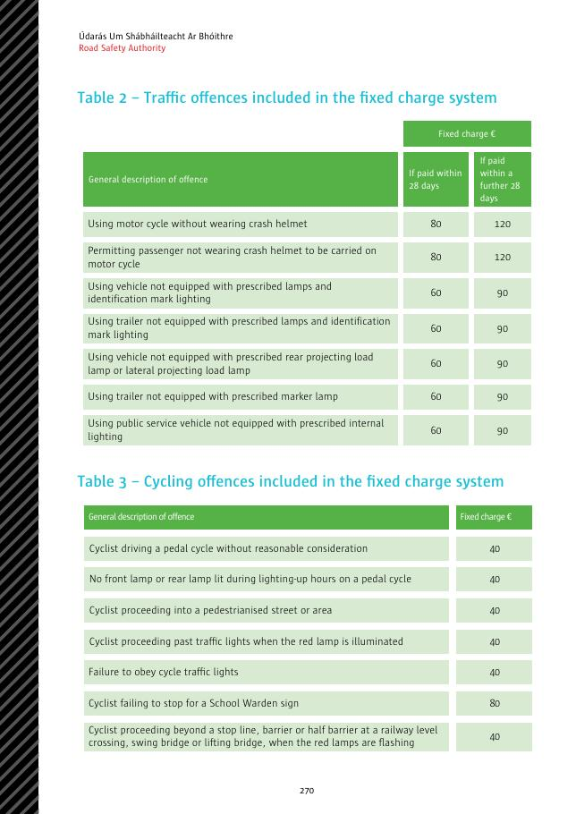
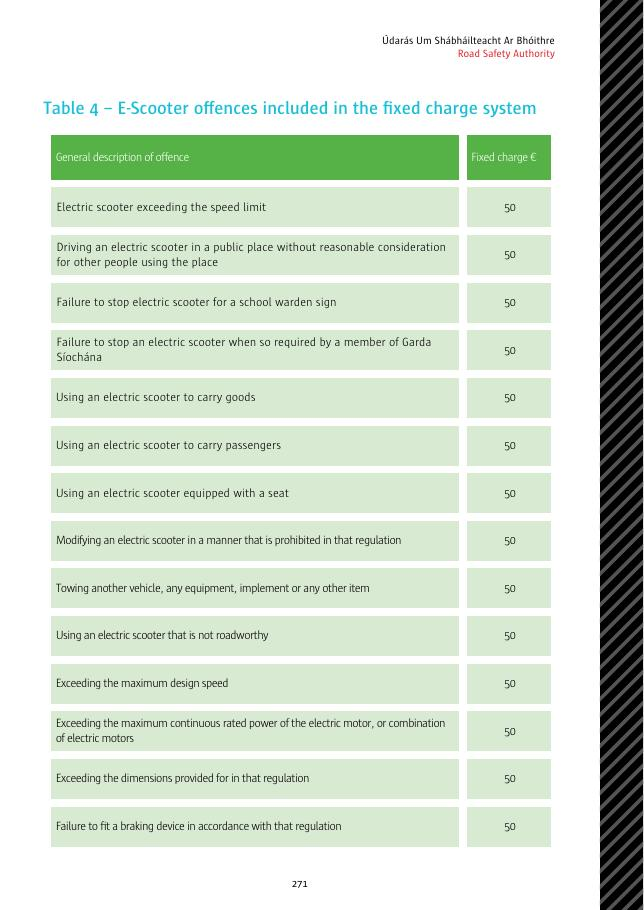
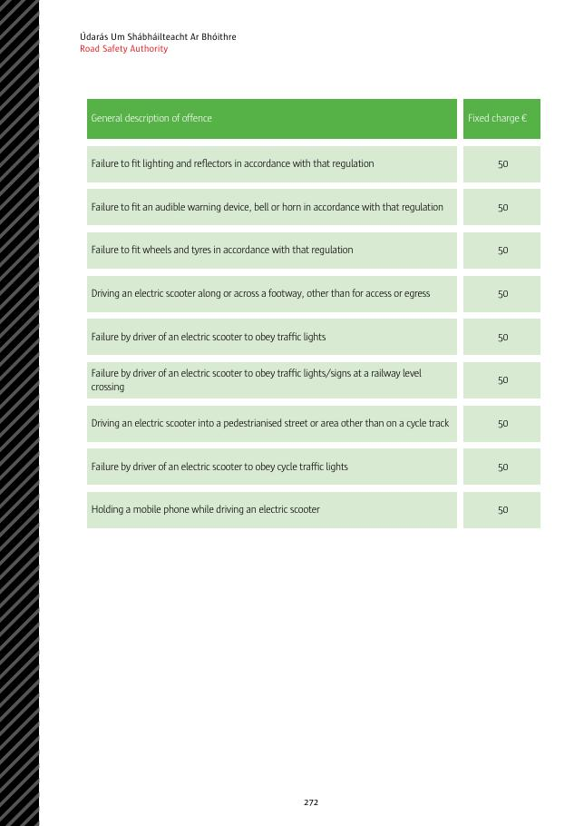

# 附录4：罚分和定额罚款违法行为

`m` 表示必须出庭。表中的罚分分别指缴付定额罚款时记入的罚分，以及经法院定罪时记入的罚分；金额分别指首 28 天及随后 28 天内缴付的金额。

> 金额和罚分可能随法律修订。以下内容翻译本 PDF 所列数据；实际处理违法行为时应核对通知和 RSA 最新资料。

## 产生罚分的违法行为

|违法行为|缴付／定罪罚分|首28天／随后28天|
|---|---:|---:|
|使用有缺陷或磨损轮胎的车辆|2／4|€80／€120|
|学习许可证持有人无人合格陪同驾驶|2／4|€160／€240|
|未展示 `N` 标志牌或背心|2／4|€120／€180|
|未展示 `L` 标志牌或背心|2／4|€120／€180|
|违反掉头禁令|2／4|€60／€90|
|违反迷你环形交叉路口规则|1／3|€60／€90|
|驶过车辆禁止进入标志|1／3|€60／€90|
|未按车道控制标志行驶或让行|1／3|€60／€90|
|在公共场所使用没有授权牌的车辆|3／5|€60／€90|
|使用被改动且资料不准确的授权牌|3／5|€60／€90|
|车辆没有规定限速器，或限速器不符合规定|3／5|€120／€180|
|车辆长度超过标示上限仍驶过最大长度标志|1／3|€60／€90|
|车辆宽度超过标示上限仍驶过最大宽度标志|1／3|€60／€90|
|DGVW 超过标示上限仍驶过最大总重安全标志|1／3|€60／€90|
|车轴载荷超过标示上限仍驶过最大轴重标志|1／3|€60／€90|
|使用没有 NCT 证书的汽车|3／5|€60／€90|
|驾驶时手持手机|3／5|€120／€180|
|危险超车|3／5|€80／€120|
|未在停车标志或停车线前停车|3／5|€80／€120|
|未在让行标志或让行线处让行|3／5|€80／€120|
|越过连续白线|3／5|€80／€120|
|车辆不遵守交通灯|3／5|€80／€120|
|未靠道路左侧行驶|2／4|€60／€90|
|违法沿中央分隔带行驶或横过中央分隔带|2／4|€60／€90|
|未按学校交通管理员标志停车|2／5|€160／€240|
|未与前车保持适当距离|3／5|€160／€240|
|不遵守交叉路口强制标志|2／4|€80／€120|
|危险位置停车|3／5|€80／€120|
|超速|3／5|€160／€240|
|汽车或货运车辆驾驶人不系安全带|3／5|€120／€180|
|未确保未满17岁后排乘客遵守安全带要求|3／5|€120／€180|
|允许未满3岁儿童不使用适当儿童约束装置|3／5|€120／€180|
|允许3岁以上儿童不使用适当儿童约束装置|3／5|€120／€180|
|允许儿童在有启用状态前气囊的座位使用后向式座椅|3／5|€120／€180|
|巴士驾驶人不系安全带|3／5|€60／€90|
|危险缺陷未修复前驾驶|必须出庭／3|法院罚款|
|驾驶有危险缺陷的车辆|必须出庭／5|法院罚款|
|使用没有适航证书的商用车辆|必须出庭／5|法院罚款|
|撞击桥梁等|必须出庭／3|法院罚款|

|未按爱尔兰警察信号行动|1／3|€80／€120|
|驶入斜线标记道路区域，例如车行道收窄车道|1／3|€80／€120|
|车辆驾驶人不遵守铁路平交道口、旋转桥或升降桥交通规则|2／5|€80／€120|
|在高速公路逆向驾驶|2／4|€80／€120|
|在高速公路硬路肩驾驶|1／3|€80／€120|
|本身限速90 km/h或以下的车辆使用高速公路外侧车道|1／3|€80／€120|
|不遵守交叉路口要求，例如转入另一道路时车道不正确|1／3|€60／€90|
|不遵守倒车要求，例如从次路倒入主路|1／3|€60／€90|
|在人行道上驾驶|1／3|€60／€90|
|在自行车道上驾驶|1／3|€60／€90|
|进入环形交叉路口时未向左行驶|1／3|€60／€90|
|未按爱尔兰警察要求停车|2／5|€80／€120|
|车辆驾驶人未让行|2／4|€80／€120|
|驾驶时未合理顾及他人|2／4|€80／€120|
|不遵守禁止性交通标志|1／3|€60／€90|
|不遵守靠左或靠右标志|1／3|€60／€90|
|不遵守车道标线|1／3|€60／€90|
|违法驶入单行道|1／3|€60／€90|
|身体不适合驾驶时驾驶|必须出庭／3|法院罚款|
|违反事故现场义务|必须出庭／5|法院罚款|
|无保险驾驶|必须出庭／5|法院罚款|
|危险超越骑自行车者或电动滑板车使用者|3／5|€120／€180|
|在指定车辆类别不系安全带或不使用适当儿童约束装置|3／5|€120／€180|
|车辆空载、满载或任何部分传递至地面的重量超过法定上限|1／3|€200／€300|
|经认定粗心驾驶|必须出庭／5|法院罚款|
|普通驾驶人 BAC 50–80 mg/100 ml|取消资格|€200|
|学习、新手或职业驾驶人 BAC 20–80 mg/100 ml|取消资格|€200|
|普通非学习、非新手、非职业驾驶人 BAC 80–100 mg/100 ml|取消资格|€400|

完整执照驾驶人累计 12 分会自动取消驾驶资格。自 2014 年 8 月 1 日起首次获发学习许可证的人，在持学习许可证期间及首张完整执照最初两年内累计 7 分，会自动取消资格。

## 其他定额罚款违法行为

|违法行为|首28天／随后28天|
|---|---:|
|骑摩托车不戴头盔|€80／€120|
|允许未戴头盔的乘客乘坐摩托车|€80／€120|
|车辆未配规定灯具及登记标志照明|€60／€90|
|挂车未配规定灯具及登记标志照明|€60／€90|
|车辆未配后伸或侧伸载荷规定灯具|€60／€90|
|挂车未配规定示廓灯|€60／€90|
|公共服务车辆未配规定内部照明|€60／€90|

## 自行车定额罚款

|违法行为|罚款|
|---|---:|
|骑脚踏自行车未合理顾及他人|€40|
|法定开灯时段前灯或尾灯未点亮|€40|
|驶入步行街或步行区|€40|
|闯红色交通灯|€40|
|不遵守自行车交通灯|€40|
|未按学校交通管理员标志停车|€80|
|铁路平交道口、旋转桥或升降桥红灯闪烁时越过停车线、栏杆或半栏杆|€40|

## 电动滑板车定额罚款

以下每项罚款均为 **€50**：

- 超过限速；在公共场所未合理顾及他人；未按学校交通管理员或警察要求停车；
- 运载货物或乘客；使用带座椅车辆；进行禁止改装；牵引车辆、设备或其他物品；
- 使用不适合上路的车辆；超过设计速度、连续额定功率或法定尺寸；
- 未按规定安装制动器、灯光、反光器、声音警告装置、铃或喇叭、车轮或轮胎；
- 除进出需要外沿人行道或横过人行道；
- 不遵守交通灯、铁路平交道口灯光或标志、或者自行车交通灯；
- 在自行车道以外驶入步行街或步行区；
- 骑行时手持手机。

## 原始罚分表

