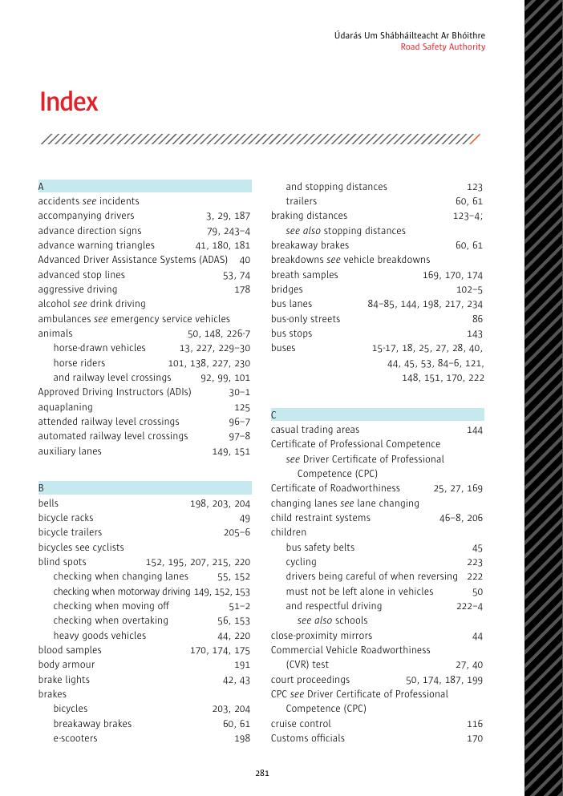
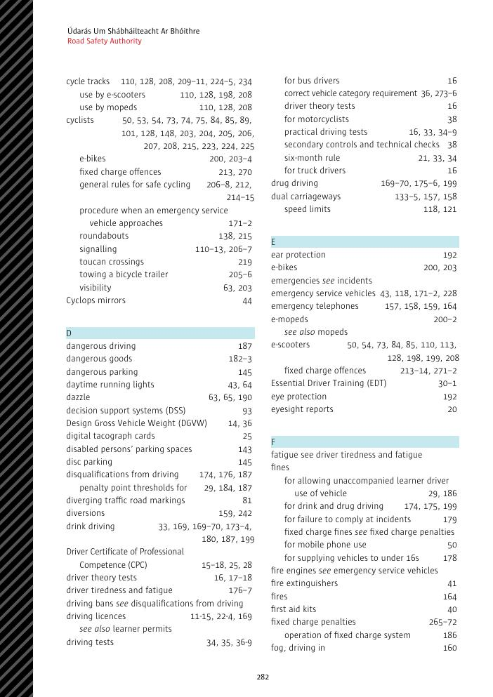
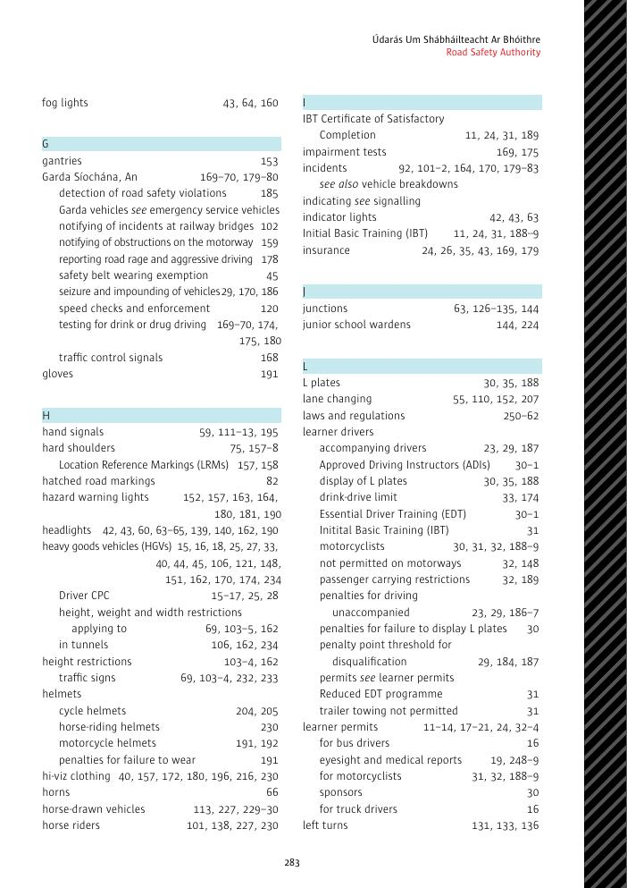
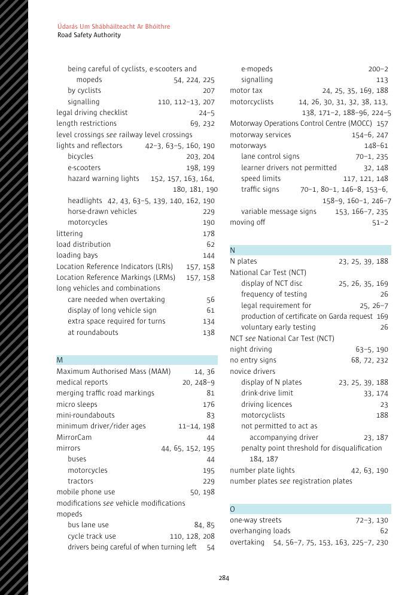
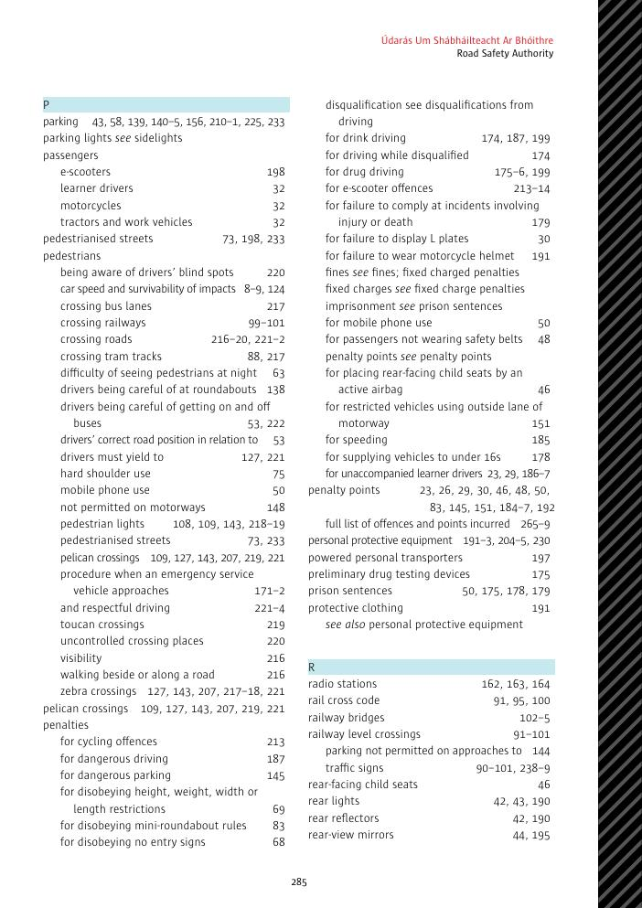
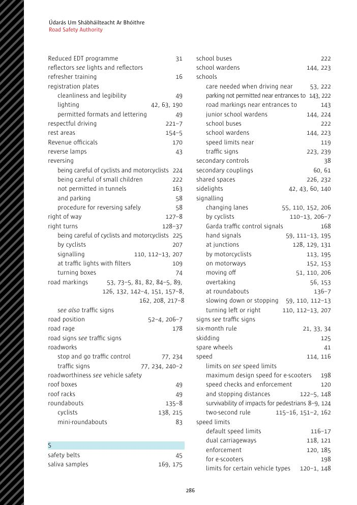
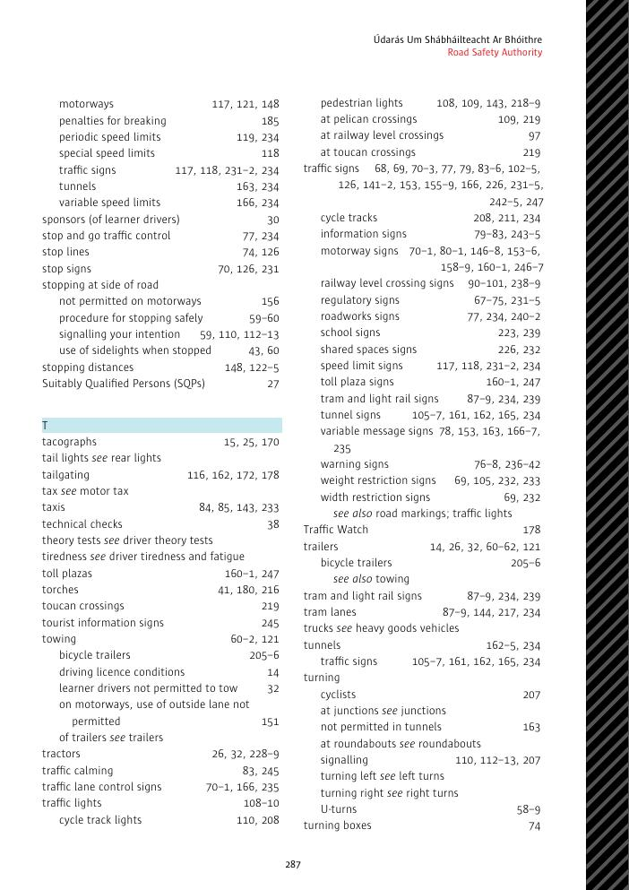
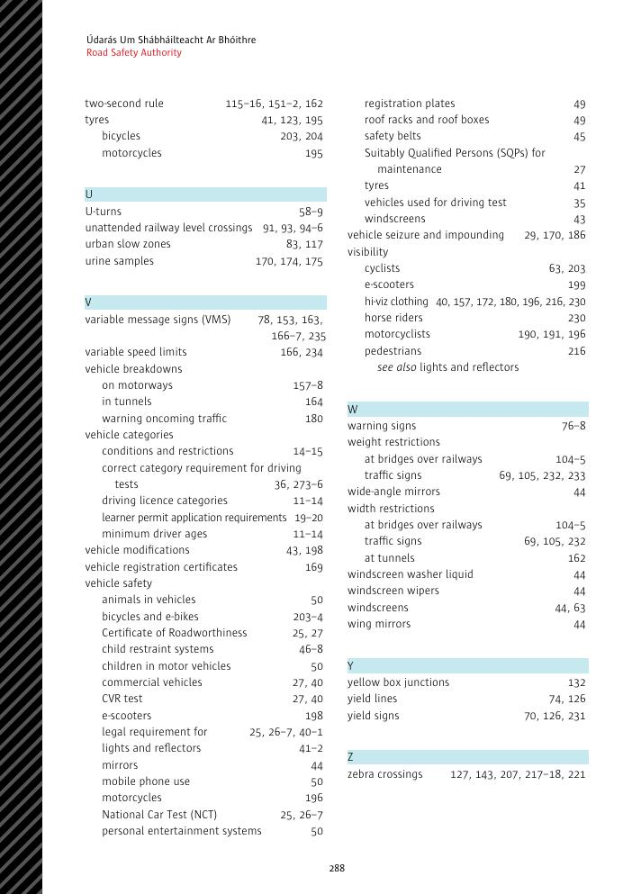
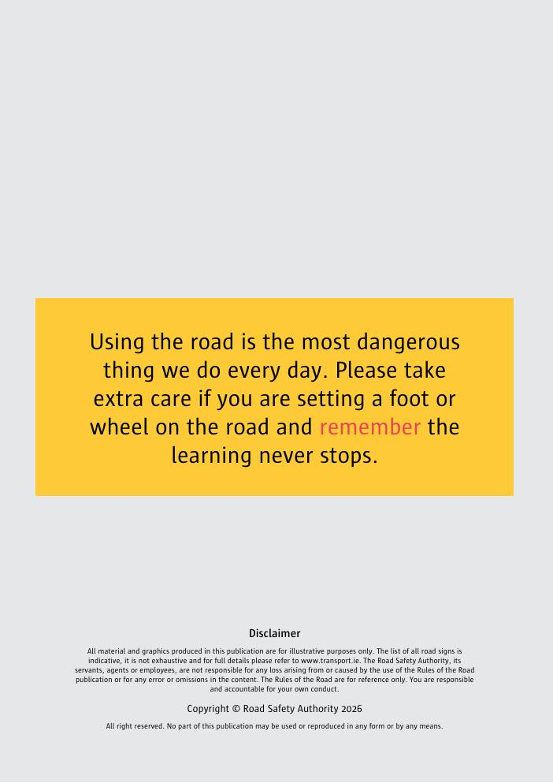
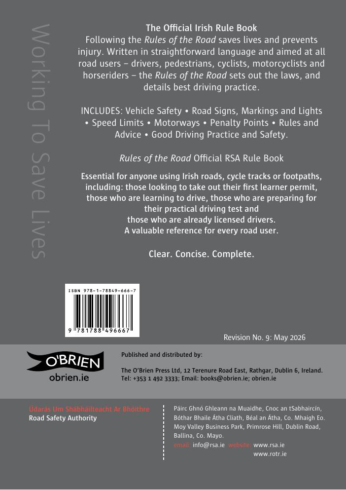

# 主题索引

本索引按中文主题归类，方便在网站中浏览。页码型英文原始索引完整保留在文末图像中；正文内容请通过下列章节链接访问。

## A–D

- 安全带、儿童约束装置：[车辆安全](05-section-04-vehicle-safety.md)
- 保险、车辆税、NCT 与商用车辆检测：[驾驶执照与车辆类别](02-section-01-driving-licences.md)
- 超车、变换车道、倒车、掉头：[良好驾驶做法](06-section-05-good-driving-practice.md)
- 车灯、反光器、挡风玻璃与后视镜：[车辆安全](05-section-04-vehicle-safety.md)
- 车速与一般、特殊速度限制：[速度限制](09-section-08-speed-limits.md)
- 车辆故障、事故现场与紧急服务：[事故现场的正确行为](15-section-14-incident-scene.md)
- 电动滑板车与 L1e-A 电动轻便摩托车：[自行车、电动滑板车及 L1e-A 规则](18-section-17-cyclists-escooters.md)
- 电车、轻轨、铁路平交道口与隧道标志：[交通标志与道路标线](07-section-06-signs-markings.md)

## E–M

- 法律、罚分、定额罚款与驾驶禁令：[罚分、定额罚款与驾驶禁令](16-section-15-penalty-points.md)、[道路交通与安全法律](28-appendix-02-road-traffic-laws.md)、[违法行为表](30-appendix-04-penalties.md)
- 高速公路与隧道驾驶：[高速公路与隧道](12-section-11-motorways-tunnels.md)
- 高速公路标志目录：[高速公路标志](26-section-25-motorway-signs.md)
- 公交道、交通缓和与道路标线：[交通标志与道路标线](07-section-06-signs-markings.md)
- 酒精、药物、疲劳、情绪、健康与分心：[影响安全驾驶的因素](14-section-13-factors-safe-driving.md)
- 驾驶考试、申请、考试车辆与结果：[驾驶考试](04-section-03-driving-test.md)、[驾驶考试代表性车辆](31-appendix-05-test-vehicles.md)
- 驾驶执照、许可证、车辆类别与 Driver CPC：[驾驶执照与车辆类别](02-section-01-driving-licences.md)
- 交叉路口、环形交叉路口与转弯：[交叉路口与环形交叉路口](10-section-09-junctions-roundabouts.md)
- 警告标志目录：[警告交通标志](23-section-22-warning-signs.md)
- 摩托车、防护装备、载客与编队：[摩托车骑手规则](17-section-16-motorcyclists.md)

## N–Z

- 农用车辆、动物、骑马者与施工机械：[其他道路使用者](21-section-20-other-road-users.md)
- 牵引、挂车与装载：[良好驾驶做法](06-section-05-good-driving-practice.md)、[车辆安全](05-section-04-vehicle-safety.md)
- 停车、候车、装卸与残障人士停车证：[停车](11-section-10-parking.md)
- 通行权、礼让与弱势道路使用者：[尊重其他道路使用者](20-section-19-respecting-road-users.md)
- 头盔、夜间能见度、骑行位置与自行车道：[自行车、电动滑板车及 L1e-A 规则](18-section-17-cyclists-escooters.md)
- 学习驾驶、陪同驾驶、L/N 标志与培训：[学习驾驶人](03-section-02-learner-driver.md)
- 夜间驾驶、前照灯、眩光与喇叭：[良好驾驶做法](06-section-05-good-driving-practice.md)
- 医疗报告适用病症：[需要医疗报告的病症](27-appendix-01-medical-reports.md)
- 信息标志目录：[信息标志](25-section-24-information-signs.md)
- 行人、儿童、老年人与残障行人：[行人规则](19-section-18-pedestrians.md)
- 与爱尔兰警察配合、停车检查与事故报告：[配合爱尔兰警察](13-section-12-assisting-gardai.md)
- 道路施工标志目录：[道路施工警告标志](24-section-23-roadworks-signs.md)
- 管制标志目录：[管制交通标志](22-section-21-regulatory-signs.md)
- 交通灯、行人信号、手势与旗语：[交通灯与信号](08-section-07-traffic-lights-signals.md)
- 术语与缩写：[术语表](33-glossary.md)
- 官方机构和实用网址：[实用网站](29-appendix-03-useful-websites.md)

## 原书英文索引页

以下图像保留原书索引的完整页码映射，便于核对官方出版物。

